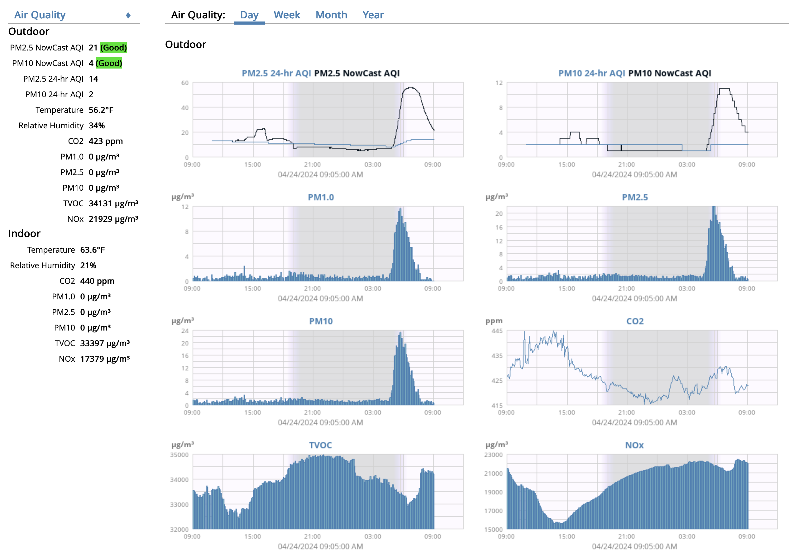

> [!NOTE]
> The data service is working, however, a formal release is not yet available as the skin is still a work in progress. Thus, to install the extension you'll need to clone this repository (for now).

# WeeWx AirGradient Extension
A [WeeWx](https://weewx.com/) extension for ingesting data from AirGradient indoor and outdoor air quality monitors.



## Requirements

### Hardware
* AirGradient ONE (I-9PSL) or Open Air (O-1PST) running firmware version 3.1.4 or later

### Software
* Python 3.9 or later
* WeeWx version 4 or later

## Installation

The extension can be installed with `weectl extension` using the commands below.

weewx v5:
```
$ source ~/weewx-venv/bin/activate
$ weectl extension install https://github.com/HumphreysCarter/weewx-airgradient/releases/latest/download/weewx-airgradient.zip
```

weewx v4:
```
$ weectl extension --install https://github.com/HumphreysCarter/weewx-airgradient/releases/latest/download/weewx-airgradient.zip
```

## Configuring Sensors
The installation script will prompt you to enter the serial number for each airgradient sensor on your network. Serial numbers should be entered one at a time, pressing enter at the end of each to move to the next prompt. Once all have been entered, type `done` into the prompt to finish the installation.

Additional sensors can be added later via the weewx config but adding the serial number of the sensor to the `sensors` list in the AirGradient and StdReport/AirGradient section.

```
[AirGradient]
    sensors = serial_no_1, serial_no_2, serial_no_3 ...  
```

The extension will then use the mDNS broadcast of the sensor via the [Local Server API](https://github.com/airgradienthq/arduino/blob/master/docs/local-server.md) to pull data and ingest into the weewx database. You can verify that the sensor is broadcasting data by going to `http://airgradient_[serial_no].local/measures/current` on the local network.